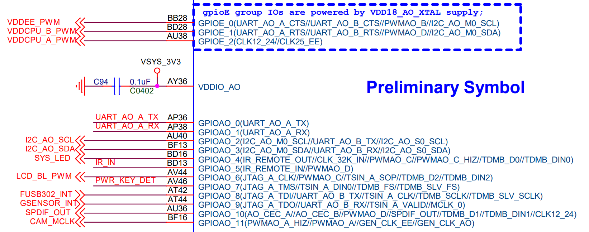

# DTS IOMUX

## AO Port 




* 如下的dts中的`groups`主要是信号组合，`function`为信号组合后的功能；
* `groups`的信号，最后一个下划线分开的字段可能是和`Bank`有关或者`Bank`引脚序号有关，主要是区分同一个`Bank`内的不同引脚或者不同的`Bank`；
* dts中的`pinctrl_aobus`，`pinctrl_periphs`只是实现分组，引脚复用功能生效是靠dts中的`pinctrl-0=<&i2c3_master_pins2>`来实现的;
* 查看当前所有的引脚的IOMUX（pinmux）：
  * cat /sys/kernel/debug/pinctrl/pinctrl@ff634480/pinmux-pins
  * cat /sys/kernel/debug/pinctrl/pinctrl@ff800014/pinmux-pins
* arch/arm64/boot/dts/amlogic/kvim3_linux.dts
  * arch/arm64/boot/dts/amlogic/mesong12b.dtsi
    ```dts
    &pinctrl_aobus {
            ao_uart_pins:ao_uart {
                    mux {
                            groups = "uart_ao_tx_a",
                                    "uart_ao_rx_a";
                            function = "uart_ao_a";
                    };
            };
    
            ao_b_uart_pins:ao_b_uart {
                    mux {
                            groups = "uart_ao_tx_b_2",
                                    "uart_ao_rx_b_3";
                            function = "uart_ao_b";
                    };
            };
    
            ao_i2c_master_pins1:ao_i2c_pins1 {
                    mux {
                            groups = "i2c_ao_sck",
                                    "i2c_ao_sda";
                            function = "i2c_ao";
                            bias-pull-up;
                            drive-strength = <2>;
                    };
            };
    
            ao_i2c_master_pins2:ao_i2c_pins2 {
                    mux {
                            groups = "i2c_ao_sck_e",
                                    "i2c_ao_sda_e";
                            function = "i2c_ao";
                            bias-pull-up;
                            drive-strength = <2>;
                    };
            };
    
            ao_i2c_slave_pins:ao_i2c_slave_pins {
                    mux {
                            groups = "i2c_ao_slave_sck",
                                    "i2c_ao_slave_sda";
                            function = "i2c_ao_slave";
                    };
            };
    
            pwm_ao_a_pins: pwm_ao_a {
                    mux {
                            groups = "pwm_ao_a";
                            function = "pwm_ao_a";
                    };
            };
    
            pwm_ao_a_hiz_pins: pwm_ao_a_hiz {
                    mux {
                            groups = "pwm_ao_a_hiz";
                            function = "pwm_ao_a";
                    };
            };
    
            pwm_ao_b_pins: pwm_ao_b {
                    mux {
                            groups = "pwm_ao_b";
                            function = "pwm_ao_b";
                    };
            };
    
            pwm_ao_c_pins1: pwm_ao_c_pins1 {
                    mux {
                            groups = "pwm_ao_c_4";
                            function = "pwm_ao_c";
                    };
            };
    
            pwm_ao_c_pins2: pwm_ao_c_pins2 {
                    mux {
                            groups = "pwm_ao_c_6";
                            function = "pwm_ao_c";
                    };
            };
    
            pwm_ao_c_hiz_pins: pwm_ao_c_hiz {
                    mux {
                            groups = "pwm_ao_c_hiz_4";
                            function = "pwm_ao_c";
                    };
            };
    
            pwm_ao_d_pins1: pwm_ao_d_pins1 {
                    mux {
                            groups = "pwm_ao_d_5";
                            function = "pwm_ao_d";
                    };
            };
    
            pwm_ao_d_pins2: pwm_ao_d_pins2 {
                    mux {
                            groups = "pwm_ao_d_10";
                            function = "pwm_ao_d";
                    };
            };
    
            pwm_ao_d_pins3: pwm_ao_d_pins3 {
                    mux {
                            groups = "pwm_ao_d_e";
                            function = "pwm_ao_d";
                    };
            };
    
            aocec_a: ao_ceca {
                    mux {
                            groups = "cec_ao_a";
                            function = "cec_ao";
                    };
            };
    
            aocec_b: ao_cecb {
                    mux {
                            groups = "cec_ao_b";
                            function = "cec_ao";
                    };
            };
            pwm_a_e2: pwm_a_e2 {
                    mux {
                            groups = "pwm_a_e2";
                            function = "pwm_a_gpioe";
                    };
            };
    };
    ```