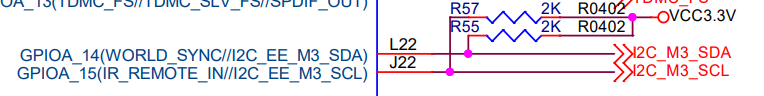

# I2C


## Schematic




## dts

* arch/arm64/boot/dts/amlogic/mesong12b.dtsi
  ```dts
  i2c3_master_pins2:i2c3_pins2 {
          mux {
                  groups = "i2c3_sda_a",
                          "i2c3_sck_a";
                  function = "i2c3";
                  bias-pull-up;
                  drive-strength = <2>;
          };
  };
  ```
* arch/arm64/boot/dts/amlogic/kvim3_linux.dts
  ```dts
  &i2c3 {
          status = "disabled";                                          // okay to disabled
          pinctrl-names="default";
          pinctrl-0=<&i2c3_master_pins2>;
          clock-frequency = <100000>; /* default 100k */
  
          ft5336@38 {
                  compatible = "edt,edt-ft5336", "ft5x06";
                  reg = <0x38>;
                  interrupt_pin = <&gpio GPIOA_5 GPIO_ACTIVE_HIGH>;
                  reset_pin = <6>;
                  status = "okay";
          };
  };
  ```


## 检查pin状态

* 修改前
  * cat /sys/kernel/debug/pinctrl/pinctrl@ff634480/pinmux-pins
    ```
    pin 64 (GPIOA_14): ffd1c000.i2c (GPIO UNCLAIMED) function i2c3 group i2c3_sda_a
    pin 65 (GPIOA_15): ffd1c000.i2c (GPIO UNCLAIMED) function i2c3 group i2c3_sck_a
    ```
* 修改后
  * cat /sys/kernel/debug/pinctrl/pinctrl@ff634480/pinmux-pins
    ```
    pin 64 (GPIOA_14): (MUX UNCLAIMED) (GPIO UNCLAIMED)
    pin 65 (GPIOA_15): (MUX UNCLAIMED) (GPIO UNCLAIMED)
    ```
